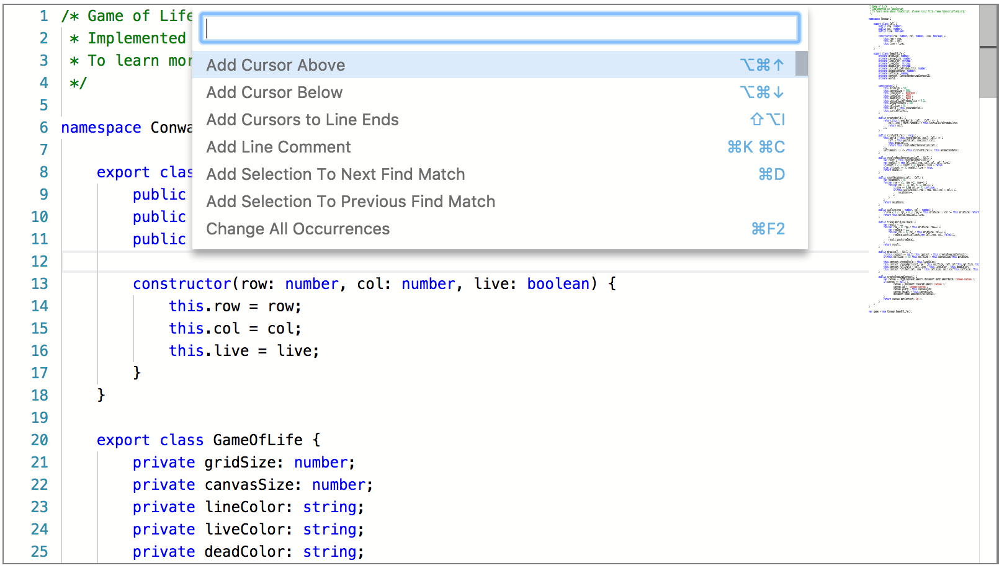
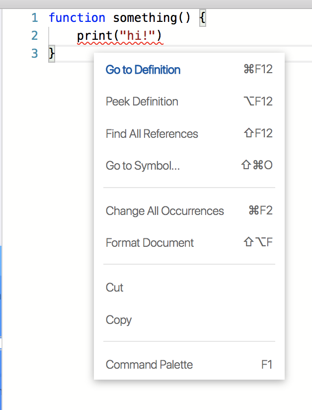

As many of us know, monaco-editor is the underlying editor used in vscode, codesandbox, many awesome deveoper IDE tools!

One of the most vscode-familiar features to monaco is the command palette and right click context menu.

Many of the default options are familiar from vscode.

## Assumptions

you already have a monaco editor instance

```ts
const editor = monaco.editor.create(document.getElementById("editor"), {
  language: "graphql",
})
```

and something for it to do:

```ts
async function doSomethingNeat() {
  await doSomething()
}
```

## Command Palette

The command palette is the first step when adding an action. All registered actions are available in the command palette, which is available when you press `F1` in an editor context, or when you select `command palette` from the right click context menu.



The minimum you need is to invoke [`addAction()`](https://microsoft.github.io/monaco-editor/api/interfaces/monaco.editor.istandalonecodeeditor.html#addaction) when using the [`IStandaloneCodeEditor`](https://microsoft.github.io/monaco-editor/api/interfaces/monaco.editor.istandalonecodeeditor.html) instance.

```ts
editor.addAction({
  id: "something-neat",
  label: "Something Neat",
  run: doSomethingNeat,
})
```

These are the minimal configurations to have a command palette entry. You can use any option in [`IActionDescriptor`](https://microsoft.github.io/monaco-editor/api/interfaces/monaco.editor.iactiondescriptor.html)

You can add keybindings to the descriptor as well:

```ts
import { KeyCode, KeyMod } from "monaco-editor"

const myAction: monaco.editor.IActionDescriptor = {
  id: "something-neat",
  label: "Something Neat",
  keybindings: [
    // eslint-disable-next-line no-bitwise
    KeyMod.CtrlCmd | KeyCode.Enter, // Ctrl + Enter or Cmd + Enter
    // eslint-disable-next-line no-bitwise
    KeyMod.CtrlCmd | KeyCode.KEY_R, // Ctrl + R or Cmd + R
  ],
  run: doSomethingNeat,
}

editor.addAction(myAction)
```

You'll need to access the bitwise enum for [`monaco.KeyMod`](https://microsoft.github.io/monaco-editor/api/classes/monaco.keymod.html) and [`monaco.KeyCode`](https://microsoft.github.io/monaco-editor/api/enums/monaco.keycode.html)

The pipe character is used to seperate multiple commands in a sequence, and the array allows you to add multiple shortcuts to one action descriptor

You may have an eslint rule `no-bitwise` enabled, the example shows you how to disable it.

## Adding your action to the context menu

Now that's pretty handy, but what if your users arent familiar with pressing `F1` to access the full command palette?

What if you want to make an important action available in the right click context as well?



You just need to add two more options to our action descriptor from above:

```ts
const myAction: monaco.editor.IActionDescriptor = {
  id: "something-neat",
  label: "Something Neat",
  contextMenuOrder: 0, // choose the order
  contextMenuGroupId: "operation", // create a new grouping
  keybindings: [
    // eslint-disable-next-line no-bitwise
    monaco.KeyMod.CtrlCmd | monaco.KeyCode.Enter,
  ],
  run: doSomethingNeat,
}
editor.addAction(myAction)
```

`contextMenuGroupId` or `contextMenuOrder` seem to be the minimum options needed, though you can use them together for a highly configurable result
