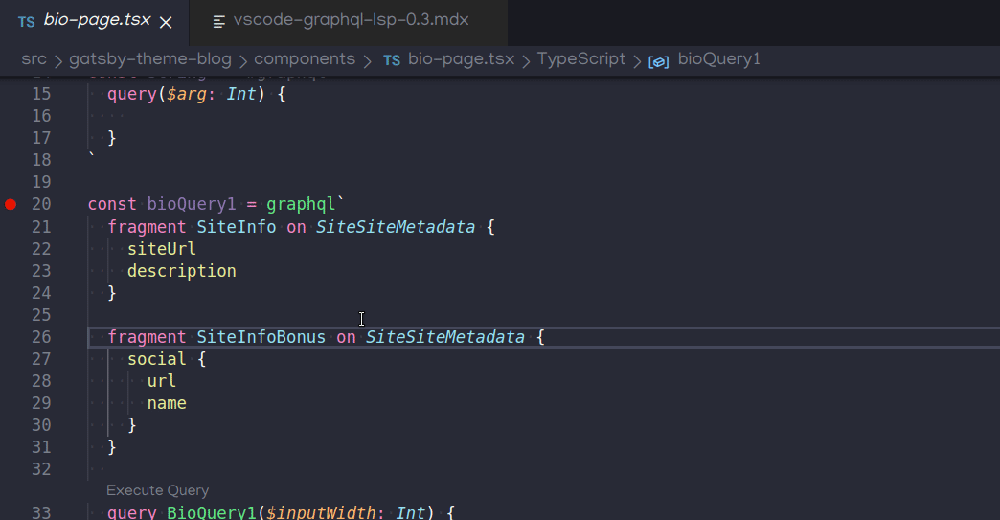
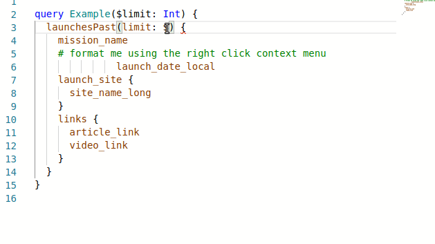
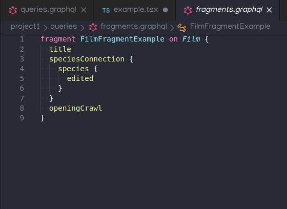
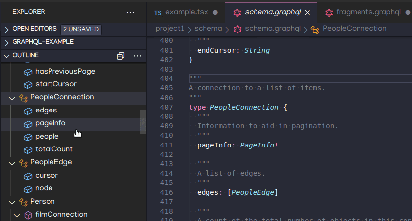
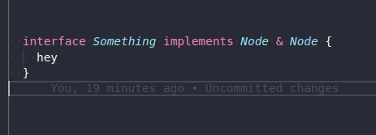
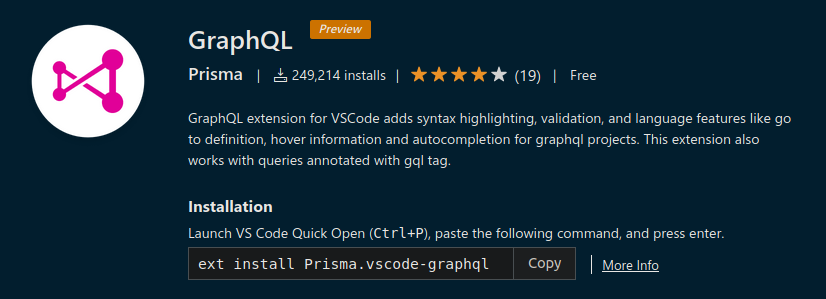

There have been some _significant_ changes to the official [GraphQL Language Service)](https://www.npmjs.com/package/graphql-language-service) and [language server](https://www.npmjs.com/package/graphql-language-service-server) itself.

This article will attempt to summarize most of the major changes that users and IDE extension authors can expect. Then at the end, we will summarize changes to [`Prisma.vscode-graphql`](https://marketplace.visualstudio.com/items?itemName=Prisma.vscode-graphql) specifically. All of the noted LSP changes impact [`Prisma.vscode-graphql`](https://marketplace.visualstudio.com/items?itemName=Prisma.vscode-graphql), as well as any other extensions using the latest [language server](https://www.npmjs.com/package/graphql-language-service-server).

Much thanks to [Divyendu Singh](https://github.com/divyenduz) for contributing to both the LSP Server and [`Prisma.vscode-graphql`](https://marketplace.visualstudio.com/items?itemName=Prisma.vscode-graphql), and to Prisma for, you guessed it, donating [`Prisma.vscode-graphql`](https://marketplace.visualstudio.com/items?itemName=Prisma.vscode-graphql) to the GraphQL Foundation. The switch should happen in the days following this blog post!

## LSP 2.4.x and 2.5.x

The minor version bump here occurred because we renamed packages after the typescript conversion and some major architectural changes for 2.4.x, repurposing `graphql-language-service` namespace from a CLI to a language-indepenent meta-project to encapsulate interface, parser, types and utils. 

The purpose here was to align more closely with other LSP implementations, where a common language service is used by both monaco and a language server.

## GraphQL LSP/Server Improvements

Most of the improvements were to the [Language Server](https://www.npmjs.com/package/graphql-language-service-server) itself.


### Typescript Conversion (2.4.x)

In late 2019 and early 2020, we finalized a conversion from flow to typescript for `graphql-language-service-*` packages, including the server. This was a huge and fun undertaking, and allowed us to de-duplicate type definitions from `vscode-language-protocol`. Much thanks to Divyendu Singh, Orta Theurox and many others who helped maked this transition possible

### Dropped Watchman Dependency (2.4.x)

[`graphql-language-service-server`](https://www.npmjs.com/package/graphql-language-service-server) was originally developed _before_ we supported the LSP protocol pattern. 

Thus, it was originally implemented with a server-side watcher, and required the installation of ye olde fb-watchman as a binary. This didn't even work in windows, and caused performance and CPU load issues for many users across IDE implementations.


### graphql-config@3!

GraphQL Config 3.x.x is fantastic, and affords us many improvements over the previous complex replacement patterns and tooling required for feeding env variables into yaml or json config replacements

we now have features like commonjs, multiple schema pointers, etc

for example, your `graphql.config.js` could look like this

```js
const scalars = `#graphql
scalar Date
scalar DateTime
scalar Email
`
module.exports = {
  schema: ["./cache/schema.graphql", scalars],
  extensions: {
    endpoints: {
      default: {
        url: "https://localhost:8000",
        headers: { Authorization: `Bearer ${process.env.API_TOKEN}` },
      },
    },
  },
}
```
#### Custom `rootDir`

You may want to load your graphql config from somewhere other than the repository root. such as a `./config/` directory. Less clutter is good!

To enable this, we exposed `rootDir` from `loadConfig()`. 

Thus, you can use `graphql-config.load.rootDir: "./config/"` in your vscode extension settings. 

More options from `loadConfig` will be supported soon!

See the [graphql-config](https://graphql-config.com/introduction) docs for more exciting new features awaiting you!

### Generated schema pattern for code first schemas



Previously, you could only use schema-defined 'peek definition' or 'find workspace symbol' features when using an SDL-first schema approach. Apollo is a great example of this. 

There are many approaches to developing GraphQL schemas, but most involve programatically generating the schema programatically in any language, also known as "code first" schema methodology.

Either approach has substantial benefits, and we wanted to ensure both were supported.

We decided to reward code-first schemas as the default vscode option. 

The former is available via a configuration option:

`vscode-graphql.useSchemaFileDefinitions: true`

it can also be enabled in the graphql config, even on a per-project basis, like so:

```yaml
projects:
  project0:
    schema: './project1/schema.graphql'
  project1:
    schema: ['./project1/schema/**/*'] # this would even pick up schema from .ts and .js files, as well as .graphql/.gql files
  project2:
    schema: 'https://localhost:8080'
    # disable here because we have a remote schema
    extensions:
      languageService:
        useSchemaFileDefinitions: false
# override it to be true by default
extensions:
  languageService:
    useSchemaFileDefinitions: true
```

### Improved embedded language support for JS, JSX, TS, TSX files

Previously, Divyendu Singh had done a great job of integrating [`ts-graphql-plugin`](https://github.com/Quramy/ts-graphql-plugin) to support embedded graphql in ts/tsx files. However, users had issues with it's interoperation with the typescript language service, and performance issues therein.

To keep language features support and logic consolidated, we decided to improve the language-server to handle typescript, by enabling @babel/parser's built in typescript parsing plugin. And yes, it will parse flow if present in js/jsx files as well.

Our _eventual_ goal is to provide support for common template tag and embedded graphql patterns in these languages, as well: `python`, `ruby`, `reason`, `java`, `rust`, `golang`, `php`, `elixir`

[@zth](https://github.com/zth) has begun work on a [powerful experimental parser using regular expressions](https://github.com/zth/vscode-graphiql-explorer/blob/master/ext-src/findGraphQLSources.ts), instead of AST.  We may make this an opt in-feature in the mid term, and once we feel confident, could very well have full support across a wide range of languages, and allow users to provide their own "parsing plugins" for parsing template tags/other features in their languages of choice. Regular Expressions are tricky for syntax parsing


### Completion for defined variables



This improvement impacts both web and desktop IDE implementations! I noticed that completion support in `interface` package did not complete for pre-defined variables.

The example shown above is actually in `monaco-graphql`! And you'll find it works in the IDE extension as well.


### Completion for "Implicit Fragments"



Does your framework or graphql implementation have fragments defined external to the operations where they are used?

Almost _all_ graphql frameworks out there seem to use this method.

IMHO, it's much better than importing fragment strings from other variables, and passing them into template replacements, which breaks graphql language parsing for IDE implementations

I decided to implement implicit fragment completion in a fashion that would transparently work with many patterns I've seen in the wild. The requirements for including your custom fragments are quite minimal.

How did we get this working? Just include the fragments in the `documents` field in graphql config:

```yml
schema: "https://localhost"
documents: ["src/components/*", "src/fragments/**/*"]
```

you can also just use a string

```js
const fragments = require('./src/fragments')

module.exports = {
  documents: ["src/components/*", fragments]
}
```

or even inline in the same file, but not the same operations

```tsx

const fragments = gql`
  fragment IdFragment on ID { string, hash }
`

const query = gql`
  id {
    ...IdFragment # this will autocomplete
  }
`
```

In the case of Gatsby, we just write all plugin-provided fragments to a cached fragments.graphql file. It will pick up all fragments defined across all files in the `documents` entry

Bonus: `vscode-graphql` will append these fragments as needed when executing operations. how about that!


### Outline Support



Traverse schema SDL, operations, other language symbol trees with ease!

### Symbols/Workspace Symbols support

Now you can find/jump to symbols within a document and across the workspace!

This is a really cool feature of vscode that I didn't even know about, but I knew we needed to become more LSP complete.

### Interfaces extending interfaces (aka & syntax)

The server has been improved to support `&` operator syntax, thanks Divyendu!




### Whats left?

So many more features we want to support, but find references/implementations is the last piece we need for the Language Server to be LSP complete.

## New NeoVIM COC plugin!

There is now an excellent coc.nvim plugin using the LSP Server

https://github.com/felippepuhle/coc-graphql#coc-graphql

## `vscode-graphql` Specific Improvements

Here are a few improvements to the `vscode-graphql` extension itself. These are client side improvements. Enjoy!

Also, thank you to the GraphQL Community for making us one of the most popular GraphQL Extensions on the marketplace!



### Scalar Validation

Now, when executing operations using the inline codelens, declared variable prompts will validate for all basic scalar types. No validation for input types. Eventually, we would like to pop out a custom editor for editing variables as JSON or yaml.

### Improved Operation Execution Error Handling

Previously, we only printed 200 responses to the execution results, but now we've configured the underlying apollo-client to return and print JSON result for all *all* status codes. As long as your graphql error responses are to spec, they will print.

Importantly, it will allow you to execute "invalid" operations as GraphiQL does, so as to allow the validation of error responses.

### Codelens option to hide execute operation

You can now provide `"vscode-graphql.showExecCodeLens": false,` to hide the "Execute {operation type}" codelens that appears above each operation

### Improved Highlighting

We made some improvements to highlighting for comments, fragment definitions, and more!

### Implicit Fragments

When executing an operation, the full implicit fragments will automatically be added to the operation payload. This allows us to use the extension with Gatsby, and should also be a welcome improvement for users of Relay and other frameworks where fragments are re-used throughout the codebase